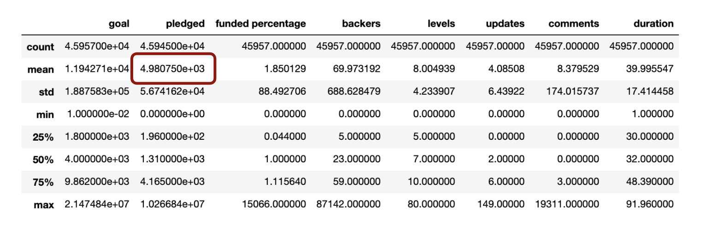
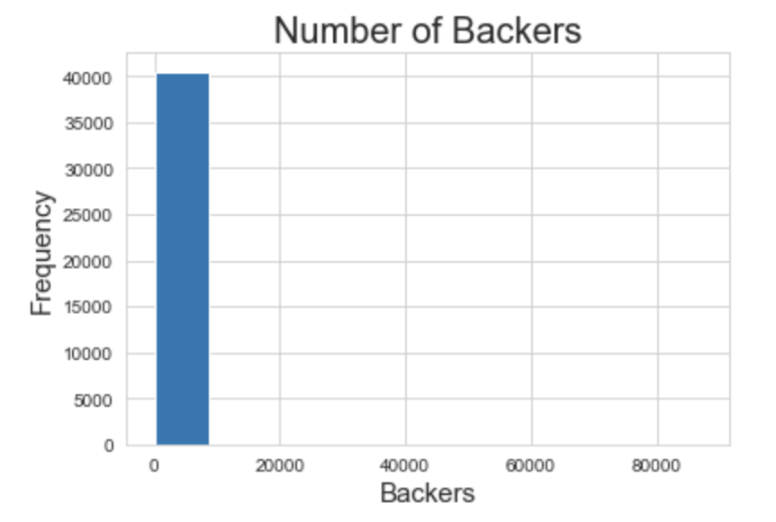
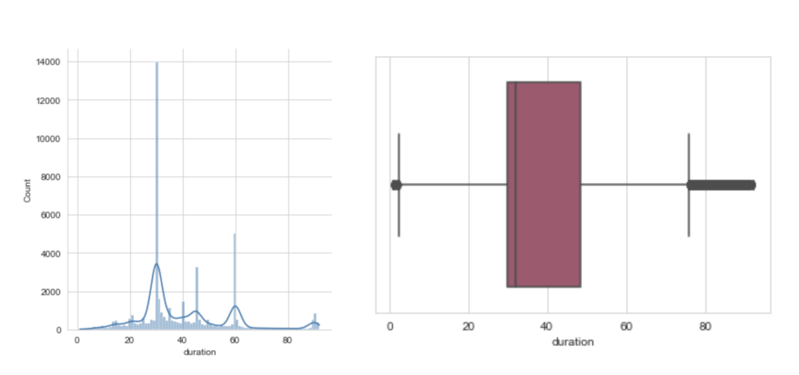
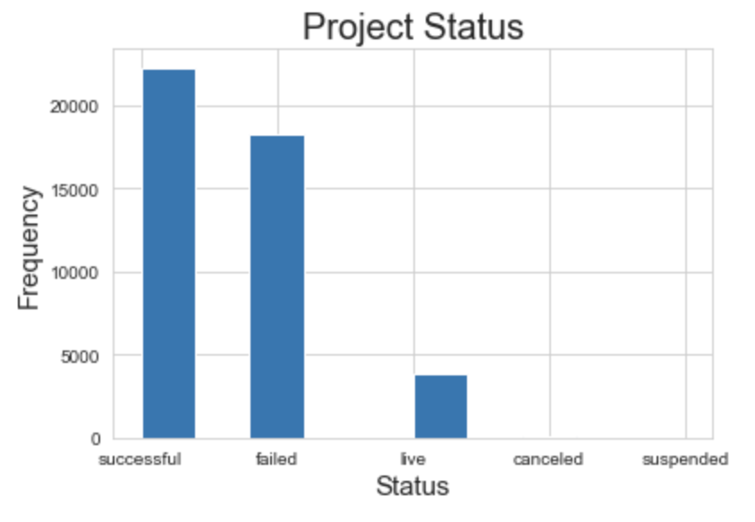
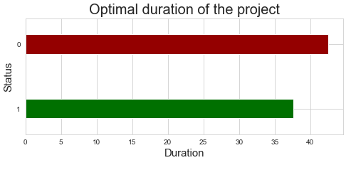
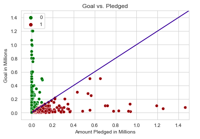
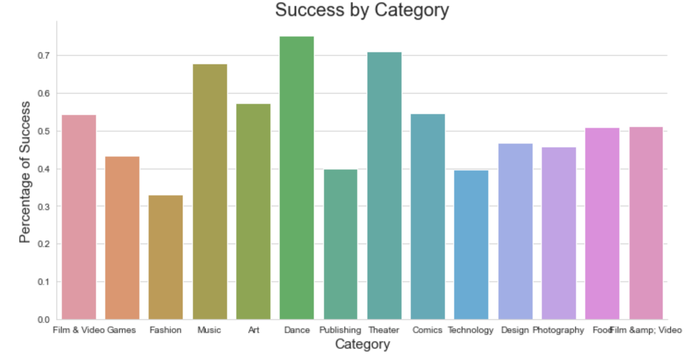
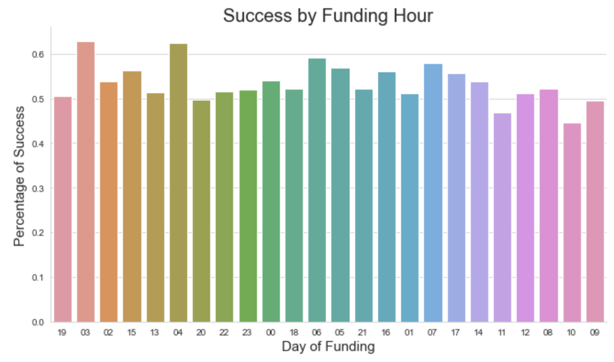
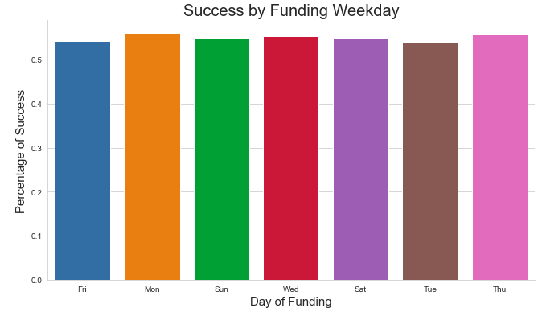
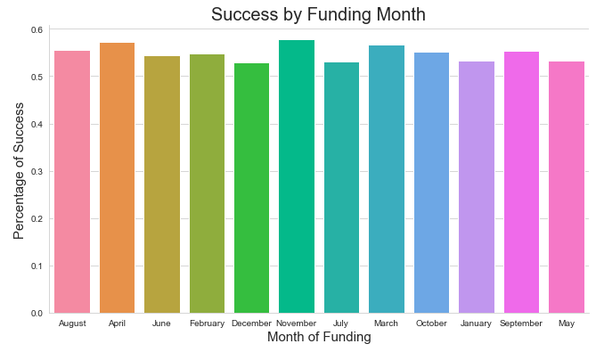

# Kickstarter Project
 Kickstarter is a crowdfunding platform that allows users to launch projects and seek investment. Based on the data provided we will try to understand why some projects are more successful than others. The main questions that we want to answer are the following:
 > What's the best length of time to run a campaign?
 >
 > What's the ideal pledge goal?
 >
 >What type of projects would be most successful at getting funded?
 >
 >Is there an ideal month/day/time to launch a campaign?

 ## Data Overview:
 #### **Numerical Data:**

__Goal:__ target funding amount of the project;
__Pledge:__ amount of funds contributed to the project;
__Funded Percentage:__ amount completed towards the goal;
__Funded Date:__ deadline for the project to be funded;
__Backers:__ users who contributed with a pledge amount to the project;
__Reward levels:__ different pledge amounts set the project;
__Updates:__ announcements made by the project;
__Comments:__ user communications with the project;
__Duration:__ amount of time for the project to run.

### **Categorical Data:**

__Project_id:__ code, identification of the project;
__Name:__ name of the project;
__Url:__ uniforme resource locator;
__Category:__ category of the project;
__Subcategory:__ subcategory of the project;
__Location:__ Country of location of the project;
__Status:__ Status of the project

## Foundation Data Analysis:
As a brief overview over the available data, the following features were observed:

•__Mean Pledge that the Project Gets__
> The mean pledge value is around 4980$ (table below):

•__Backer Variable__
> Backer variable doesn't have a normal distribution. The histogram shows that almost all the results are concentrated between zero and 10k, doesn’t reveal a symmetric bell curve characteristic of a normal distribution. This means that the data is skewed, and there is a degree of distortion from the symmetrical bell curve, mean, mode and median are not matching. When calculating the skew of the distribution I obtained a value of 87.75.  

•__Duration Variable__
>The shape of the histogram is not specifically defined, but we can note that is trimodal, having three separated classes or intervals, representing the maximum frequency of the distribution.
>If we look at the  box plot, we can see that the median is not centred in the boxplot and is not coincident with the mean. The boxplot is left-skewed which indicates that the data doesn't follow a normal distribution. Outliers are also easily identified representing a bigger number on the right side of the boxplot, in comparison to the left side.

## Qualitative Analysis:
Looking at the histogram of the project status, we can see, that we have 5 different status (successful, failed, live, canceled and suspended). From this point the analysis will be focus on the successful and failed projects.

•__Optimal Duration__
>Projects on Kickstarter last on average from 1 - 50 days. The campaigns with shorter durations such as around 37 days show higher success rate.

•__Pledge Goal__
>Projects with smaller goals ,such as 5000 dollars, are more certain to be successful. Projects where the amount pledge was pretty high, didn’t arrive even close to achieving the goal.

•__Success by category__
>Look at this graph we can see that the dance category has higher percentage of successfully achieving its goal when compared with others, and fashion is lowest category in this range.

•__Ideal time to launch a campaign__
>These graphs show the success during all every month of the year, days of the week and hours of the day. We can assume that there is no special tendency here and there is no ideal month, day or time to fund a project.

